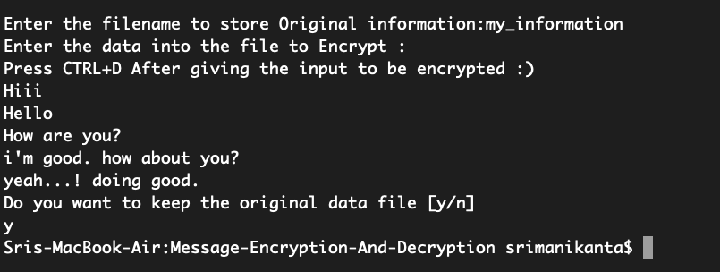

# Message-Encryption-And-Decryption

--> A simple Encryption and Decryption tool to Encrypt and decrypt our confidential, sensitive, and 	important text data.
--> This tool will help to encrypt our text data with the help of symmetric cryptographic algorithm.
	and the encrypted data can also be decrypted with the help of this tool.
--> Both sender and receiver can use this tool to encrypted and decrypted their data to transfer 		from one place to another with high confidentiality.

### Script Main Window

### Encryption

   

1. While entering the data to the file that want to encrypt.
2. Press CTRL + D after input message is given completely.

##### Generated File after Encryption:

